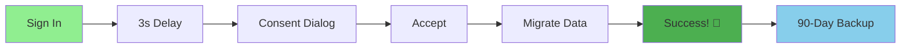
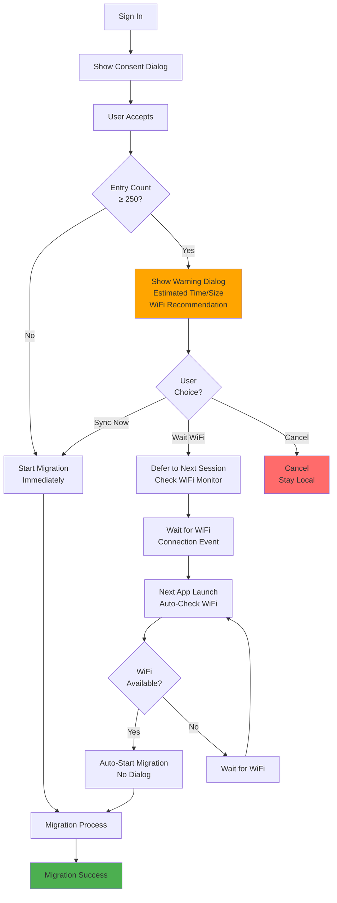
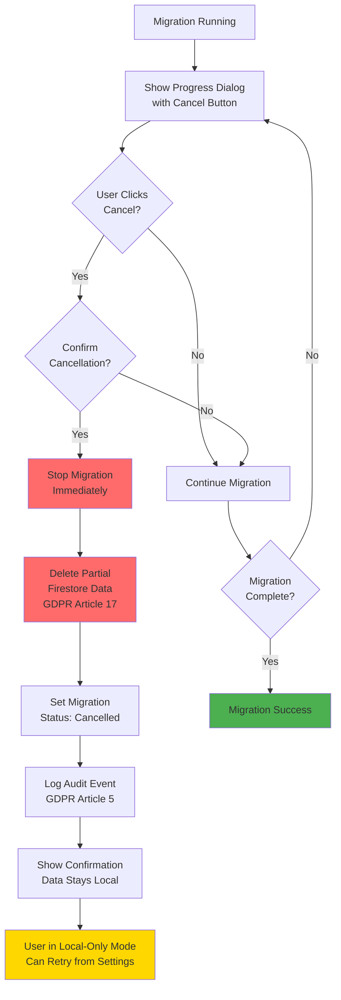
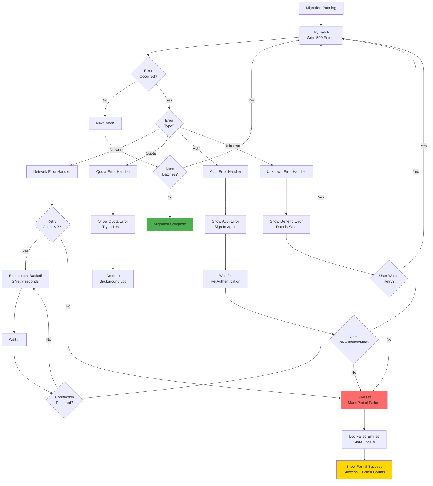
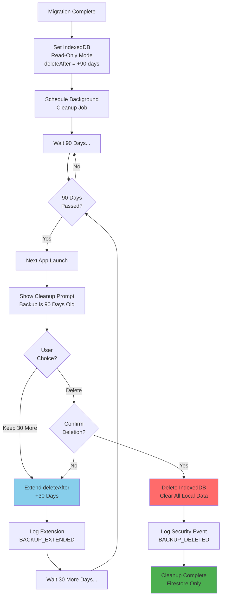
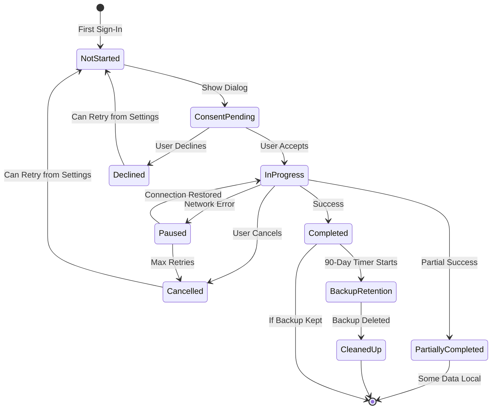

# Issue #40: Migration User Flow Diagram

**Date:** 2026-03-04
**Purpose:** Visual representation of all migration decision points and flows
**Format:** Mermaid diagrams (renders on GitHub)

---

## Complete Migration Flow

```mermaid
flowchart TD
    Start([User Signs In<br/>for First Time]) --> CheckMigration{Migration<br/>Already Done?}

    CheckMigration -->|Yes| SkipMigration[Skip Migration<br/>Use Firestore Data]
    CheckMigration -->|No| CheckEntries{Has Local<br/>IndexedDB Entries?}

    CheckEntries -->|No| NoMigration[No Migration Needed<br/>Start Fresh in Firestore]
    CheckEntries -->|Yes| Delay[3-Second Delay<br/>App Loads]

    Delay --> ConsentDialog[Show Consent Dialog<br/>GDPR Article 6]

    ConsentDialog --> UserChoice{User<br/>Decision?}

    UserChoice -->|Decline| Declined[Migration Declined<br/>Stay Local-Only<br/>Log Event]
    UserChoice -->|Accept| CheckDataset{Entry<br/>Count?}

    CheckDataset -->|< 250| StartMigration[Start Migration<br/>No Warning]
    CheckDataset -->|≥ 250| ShowWarning[Show Large Dataset Warning<br/>Estimated Time/Size]

    ShowWarning --> WarningChoice{User<br/>Choice?}
    WarningChoice -->|Sync Now| StartMigration
    WarningChoice -->|Wait WiFi| DeferMigration[Defer to Next Session<br/>Check WiFi Status]
    WarningChoice -->|Cancel| Declined

    StartMigration --> MigrateLoop[Batch Migration Loop<br/>500 entries/batch]

    MigrateLoop --> CheckDuplicate{Entry<br/>Exists in<br/>Firestore?}

    CheckDuplicate -->|No| WriteFresh[Write to Firestore<br/>Create New Entry]
    CheckDuplicate -->|Yes| CompareTimes{Compare<br/>Timestamps}

    CompareTimes -->|Local Newer| WriteLocal[Update Firestore<br/>Last-Write-Wins]
    CompareTimes -->|Firestore Newer| SkipEntry[Skip Entry<br/>Firestore Wins]
    CompareTimes -->|Equal| SkipEntry

    WriteFresh --> UpdateProgress[Update Progress<br/>{completed}/{total}]
    WriteLocal --> UpdateProgress
    SkipEntry --> UpdateProgress

    UpdateProgress --> CheckCancel{User Clicked<br/>Cancel?}

    CheckCancel -->|Yes| CancelFlow[Stop Migration<br/>Delete Partial Data<br/>Log Cancellation]
    CheckCancel -->|No| CheckMore{More<br/>Entries?}

    CheckMore -->|Yes| CheckNetwork{Network<br/>OK?}
    CheckMore -->|No| MigrationSuccess[Migration Success!<br/>Mark Complete in Firestore]

    CheckNetwork -->|Yes| MigrateLoop
    CheckNetwork -->|No| NetworkError[Network Error<br/>Pause Migration]

    NetworkError --> RetryChoice{Retry<br/>Strategy}
    RetryChoice -->|Auto Retry| WaitBackoff[Wait with<br/>Exponential Backoff]
    RetryChoice -->|Max Retries| PartialFail[Partial Migration<br/>Log Failed Entries]

    WaitBackoff --> CheckNetwork

    MigrationSuccess --> SetBackup[Set IndexedDB to<br/>Read-Only Backup<br/>90-Day Retention]

    SetBackup --> ShowSuccess[Show Success Dialog<br/>🎉 Celebration<br/>CEO Addition]

    CancelFlow --> CancelConfirm[Show Cancellation<br/>Confirmation<br/>Data Stays Local]

    PartialFail --> ShowPartial[Show Partial Success<br/>Success Count + Failed Count]

    ShowSuccess --> Done([User Can Access<br/>Data from Any Device])
    CancelConfirm --> LocalOnly([User Stays<br/>Local-Only Mode])
    ShowPartial --> PartialDone([Some Data Synced<br/>Some Local-Only])
    Declined --> LocalOnly
    NoMigration --> Done
    SkipMigration --> Done

    style Start fill:#90EE90
    style Done fill:#90EE90
    style LocalOnly fill:#FFD700
    style PartialDone fill:#FFD700
    style CancelFlow fill:#FF6B6B
    style NetworkError fill:#FF6B6B
    style MigrationSuccess fill:#4CAF50
```

---

## Happy Path (Simplified)



---

## Large Dataset Path



---

## Cancellation Flow



---

## Error Handling Flow



---

## Manual Trigger Flow (Settings)

```mermaid
flowchart TD
    Start[User Opens Settings] --> NavSync[Navigate to<br/>Data & Sync Section]

    NavSync --> ShowButton[Show Sync to Cloud Button]

    ShowButton --> CheckStatus{Migration<br/>Already Done?}

    CheckStatus -->|Yes| DisableButton[Button Disabled<br/>Already Synced ✓]
    CheckStatus -->|No| EnableButton[Button Enabled<br/>Tap to Sync]

    EnableButton --> UserTap{User<br/>Taps Button?}

    UserTap -->|No| StaySettings[Stay in Settings]
    UserTap -->|Yes| CheckEntries{Has Local<br/>Entries?}

    CheckEntries -->|No| NoData[Show Info<br/>No Data to Sync]
    CheckEntries -->|Yes| ConfirmDialog[Show Confirmation<br/>{count} Entries<br/>Mobile Data Warning]

    ConfirmDialog --> UserConfirm{User<br/>Confirms?}

    UserConfirm -->|No| StaySettings
    UserConfirm -->|Yes| StartManual[Start Migration<br/>Manual Trigger]

    StartManual --> ShowProgress[Show Progress Dialog<br/>Can Cancel]

    ShowProgress --> MigrationFlow[Standard Migration Flow<br/>See Main Diagram]

    MigrationFlow --> Result{Result?}

    Result -->|Success| ShowSuccess[Show Success Toast<br/>Return to Settings]
    Result -->|Failed| ShowError[Show Error<br/>Offer Retry]
    Result -->|Cancelled| ShowCancel[Show Cancellation<br/>Return to Settings]

    ShowSuccess --> UpdateUI[Update Settings UI<br/>Button Disabled]
    ShowError --> StaySettings
    ShowCancel --> StaySettings

    style StartManual fill:#4169E1
    style ShowSuccess fill:#4CAF50
    style ShowError fill:#FF6B6B
```

---

## 90-Day Backup Cleanup Flow



---

## Decision Points Summary

| Decision Point | Options | Default | Can Change |
|----------------|---------|---------|------------|
| **Migration Timing** | Immediate / Delayed | Delayed (3s) | No |
| **User Consent** | Accept / Decline | - | User Choice |
| **Large Dataset Warning** | Sync Now / Wait WiFi / Cancel | - | User Choice |
| **During Migration** | Continue / Cancel | Continue | User Choice |
| **Network Error** | Auto Retry / Give Up | Auto Retry (3x) | No |
| **Duplicate Handling** | Last-Write-Wins / Manual | Last-Write-Wins | No |
| **IndexedDB Retention** | Keep 90 Days / Delete Now | Keep 90 Days | User Choice |
| **Backup Cleanup** | Delete / Extend 30 Days | - | User Choice |
| **Manual Trigger** | Available / Not Available | Available | No |

---

## State Transitions



---

## Implementation Notes

### Rendering on GitHub
These Mermaid diagrams will render automatically in GitHub Issues and Pull Requests. To view locally:
1. Install Mermaid Live Editor extension in VS Code, or
2. Use https://mermaid.live/ to preview

### Updating the Diagram
If business logic changes:
1. Update this file
2. Reference in Issue #40
3. Keep synchronized with implementation

### Color Legend
- 🟢 Green: Success states
- 🔴 Red: Error/cancellation states
- 🟡 Yellow: Partial/intermediate states
- 🔵 Blue: User action required
- ⚪ White: Process steps

---

**Created:** 2026-03-04
**For:** Issue #40 - IndexedDB to Firestore Migration
**Gap:** User flow diagram (LOW priority)
**Status:** Ready for developer reference
